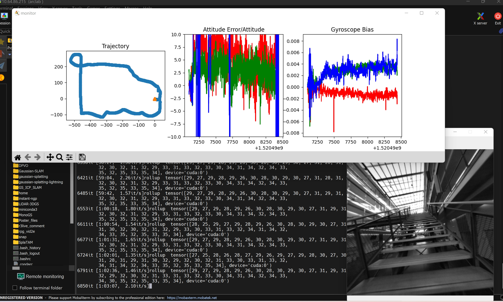
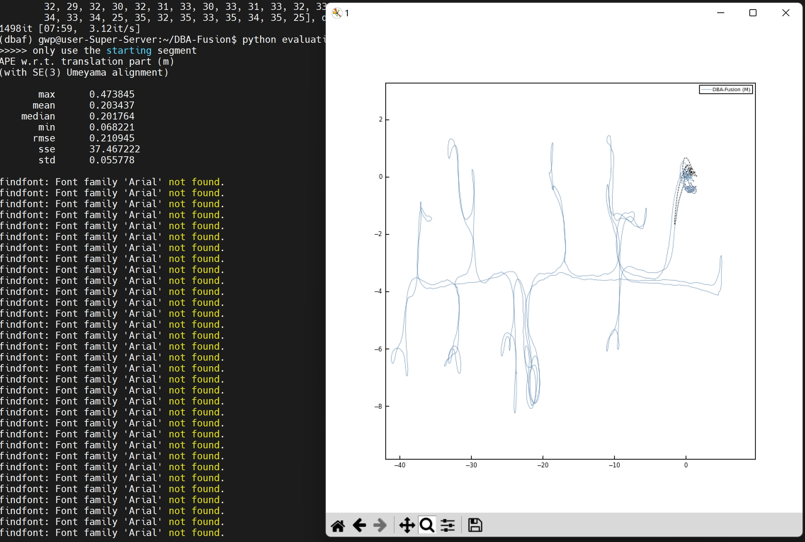
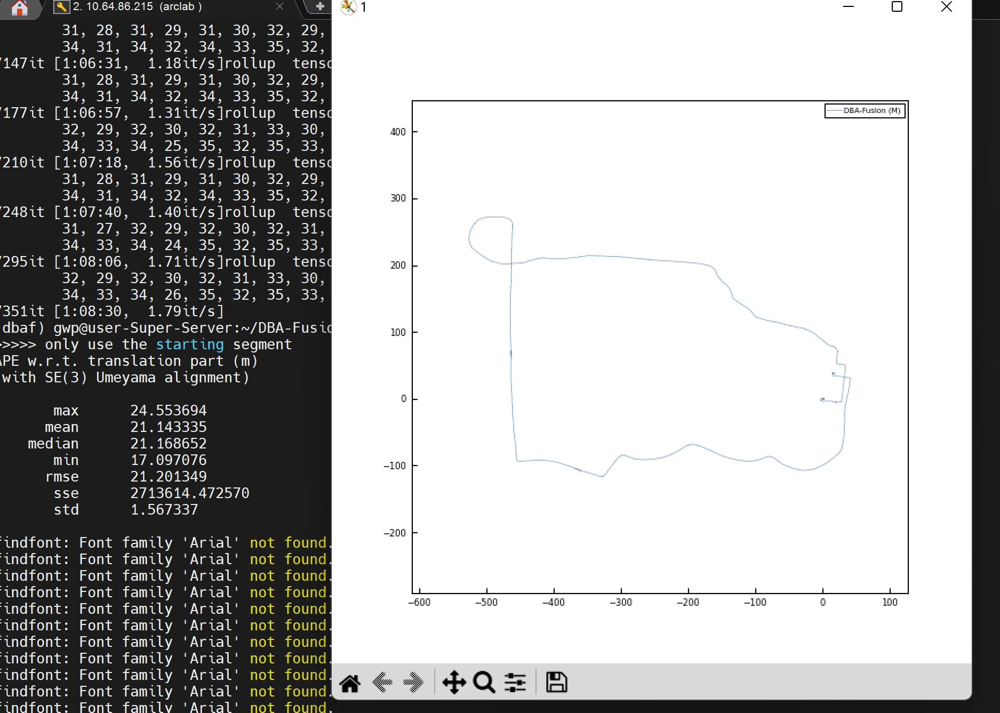

[comment]: <> (# DBA-Fusion)

<!-- PROJECT LOGO -->

<p align="center">

  <h1 align="center"> DBA-Fusion (复现及中文注释版~仅供个人学习记录用)
  </h1>

[comment]: <> (  <h2 align="center">PAPER</h2>)
  <h3 align="center">
  <a href="https://arxiv.org/pdf/2403.13714">Paper</a> 
  | <a href="https://github.com/GREAT-WHU/DBA-Fusion">Original Github Page</a>
  | <a href="https://kwanwaipang.github.io/File/Blogs/Poster/Learning_based_VO.html">Survey for Learning-based VO</a>
  </h3>
  <div align="center"></div>

# 配置过程记录
* 下载代码
~~~
git clone --recurse-submodules https://github.com/GREAT-WHU/DBA-Fusion.git
~~~
* 创建conda环境
~~~
conda create -n dbaf python=3.10.11
conda activate dbaf

pip install torch==1.11.0+cu113 torchvision==0.12.0+cu113 torchaudio==0.11.0 --extra-index-url https://download.pytorch.org/whl/cu113
pip install torch-scatter==2.0.9 -f https://data.pyg.org/whl/torch-1.11.0+cu113.html
pip install gdown tqdm numpy==1.25.0 numpy-quaternion==2022.4.3 opencv-python==4.7.0.72 scipy pyparsing matplotlib h5py 
pip install evo --upgrade --no-binary evo
pip install open3d # optional for visualization (这是可视化的，应该只有MobaXterm可用)
~~~
* 安装GTSAM（作者在原版GTSAM的基础上做了一些基于python的改进，已把此代码push到thirdparty文件内）
~~~
cd thirdparty
git clone https://github.com/ZhouTangtang/gtsam.git
cd gtsam
<!-- rm -rf .git -->
mkdir build
cd build
cmake .. -DGTSAM_BUILD_PYTHON=1 -DGTSAM_PYTHON_VERSION=3.10.11
make python-install
~~~
* 然后安装DBA-Fusion
~~~
cd 到DBA-Fusion目录
python setup.py install
~~~

# 代码测试
* 下载预训练好的模型（demo_vio_tumvi.py文件中的参数--weights带有默认值）
~~~
<!-- pip install gdown -->

https://drive.google.com/file/d/1PpqVt1H4maBa_GbPJp4NwxRsd9jk-elh/view
~~~
* TUM-VI数据集 [网页](https://cvg.cit.tum.de/data/datasets/visual-inertial-dataset); [下载链接](https://cdn2.vision.in.tum.de/tumvi/exported/euroc/512_16/)
~~~
cd dataset
wget https://cdn2.vision.in.tum.de/tumvi/exported/euroc/512_16/dataset-corridor1_512_16.tar
wget https://cdn2.vision.in.tum.de/tumvi/exported/euroc/512_16/dataset-outdoors6_512_16.tar

<!-- 解压 -->
tar -xvf dataset-corridor1_512_16.tar
~~~
* 为了加速处理，将文件转换位h5文件
~~~
python dataset/tumvi_to_hdf5.py --imagedir=${DATASET_DIR}/dataset-${SEQ}_512_16/mav0/cam0/data --imagestamp=${DATASET_DIR}/dataset-${SEQ}_512_16/mav0/cam0/data.csv --h5path=${SEQ}.h5 --calib=calib/tumvi.txt --stride 4

python dataset/tumvi_to_hdf5.py --imagedir=dataset/dataset-corridor1_512_16/mav0/cam0/data --imagestamp=dataset/dataset-corridor1_512_16/mav0/cam0/data.csv --h5path=dataset/dataset-corridor1_512_16/dataset-corridor1_512_16.h5 --calib=calib/tumvi.txt --stride 4

python dataset/tumvi_to_hdf5.py --imagedir=dataset/dataset-outdoors6_512_16/mav0/cam0/data --imagestamp=dataset/dataset-outdoors6_512_16/mav0/cam0/data.csv --h5path=dataset/dataset-outdoors6_512_16.h5 --calib=calib/tumvi.txt --stride 4
~~~
* 在batch_tumvi.py文件中修改数据的路径，若是采用h5文件则需要添加对应的 "--enable_h5" and "--h5_path" (注意此处带有可视化，在服务器上运行应该采用MobaXterm)
~~~
cd DBA-Fusion/
conda activate dbaf
python batch_tumvi.py  # This would trigger demo_vio_tumvi.py automatically.

python batch_tumvi_outdoors6.py 
~~~
<div align=center>

</div>
* demo 视频见link<sup>
[1]()
</sup>.

* evaluation: (注意，需要到代码中修改--ref_file的地址)
~~~
python evaluation_scripts/evaluate_tumvi.py --seq corridor1

python evaluation_scripts/evaluate_tumvi.py --seq outdoors6
~~~

长走廊测试。
<div align=center>

</div>

<br>
室外大场景，最终没能回到原点，有较为明显的回环问题，但是场景尺度很大（大约40~50分钟），加入回环检测可以解决改问题。
<div align=center>

</div>

* 3D 可视化（注意修改代码中的 .pkl 文件的路径，它包含了all keyframe poses and point clouds.
）
~~~
python visualization/check_reconstruction_tumvi.py

# or 

python visualization/check_reconstruction_tumvi_animation.py
~~~
* 可视化的时候遇到报错```libGL error: MESA-LOADER: failed to open swrast:```这应该是需要建立软链接
~~~
cd /usr/lib/
sudo mkdir dri
# 上面两步是创建文件夹并且进入到对应的文件夹中，然后再软连接一下
ln -s /lib/x86_64-linux-gnu/dri/swrast_dri.so swrast_dri.so
~~~
* 若再报错```libGL error: MESA-LOADER: failed to open swrast: /home/gwp/miniconda3/envs/dbaf/bin/../lib/libstdc++.so.6: version `GLIBCXX_3.4.30' not found (required by /lib/x86_64-linux-gnu/libLLVM-15.so.1) (search paths /usr/lib/x86_64-linux-gnu/dri:\$${ORIGIN}/dri:/usr/lib/dri, suffix _dri)```
~~~
 conda install -c conda-forge gcc
~~~
* demo 视频见link<sup>
[1](https://www.bilibili.com/video/BV1y1421b7ug/?vd_source=a88e426798937812a8ffc1a9be5a3cb7)
</sup>.

# 代码解读
* demo_vio_tumvi.py